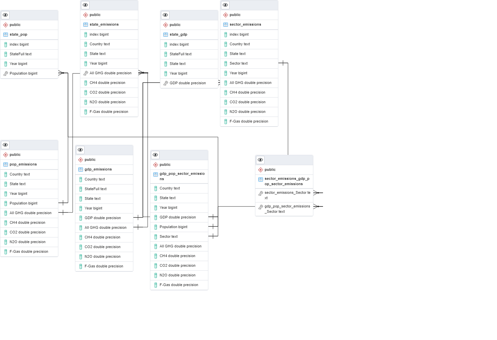

# Database Integration

## Database Used
We are using a PostgreSQL database in order to make manipulation of the data more cohesive and simple in comparison to MongoDB, as we will want to perform many different joins and other operations in order to extract data for our ML model.

ERD: 

## Method Used to Link Database to Project
We will link the PostgreSQL database to the project through Tableau, and use that to create our visualizations dashboard

## Tables Present in Database
 - US Emissions by State by Year
    - Name: state_emissions
 - US Emissions by State by Sector by Year
    - Name: sector_emissions
 - GDP by State by Year
    - Name: state_gdp
 - Population by State by Year
    - Name: state_pop
 - GDP vs Pop vs Emissions by Year (created by SQL join)
    - Name: gdp_pop_sector_emissions
 - GDP vs Emissions by Year (created by SQL join)
    - Name: gdp_emissions
 - Pop vs Emissions by Year (created by SQL join)
    - Name: pop_emissions
## Joins Used in Database
 - Joining Sector, GDP, and Pop Data:
```
CREATE TABLE gdp_pop_sector_emissions AS (SELECT 
	sector_emissions."Country", state_gdp."State", state_gdp."Year", state_gdp."GDP", 
	state_pop."Population", sector_emissions."Sector", sector_emissions."All GHG",
	sector_emissions."CH4", sector_emissions."CO2", sector_emissions."N2O", sector_emissions."F-Gas"
FROM state_gdp
JOIN sector_emissions 
	ON state_gdp."State"=sector_emissions."State"
		AND state_gdp."Year"=sector_emissions."Year"
JOIN state_pop 
	ON state_gdp."StateFull"=state_pop."StateFull"
		AND state_gdp."Year"=state_pop."Year");
```
 - Joining GDP and State Emissions Data
```
CREATE TABLE gdp_emissions AS (SELECT
	state_emissions."Country", state_gdp."StateFull", state_gdp."State", state_gdp."Year", state_gdp."GDP",
	state_emissions."All GHG", state_emissions."CH4", state_emissions."CO2", state_emissions."N2O",
	state_emissions."F-Gas"
FROM state_gdp
JOIN state_emissions
	ON state_gdp."State"=state_emissions."State"
		AND state_gdp."Year"=state_emissions."Year");
```
 - Joining gdp_emissions and state_pop to get a Pop/Emissions Table

 ```
 CREATE TABLE pop_emissions AS (SELECT
	gdp_emissions."Country", gdp_emissions."State", gdp_emissions."Year", state_pop."Population",
	gdp_emissions."All GHG", gdp_emissions."CH4", gdp_emissions."CO2", gdp_emissions."N2O",
	gdp_emissions."F-Gas"
FROM state_pop
JOIN gdp_emissions
	ON state_pop."StateFull"=gdp_emissions."StateFull"
		AND state_pop."Year"=gdp_emissions."Year");
```

## Connection String used in Database
We used SQLAlchemy and psycopg2 to connect the cleaned data into the database.